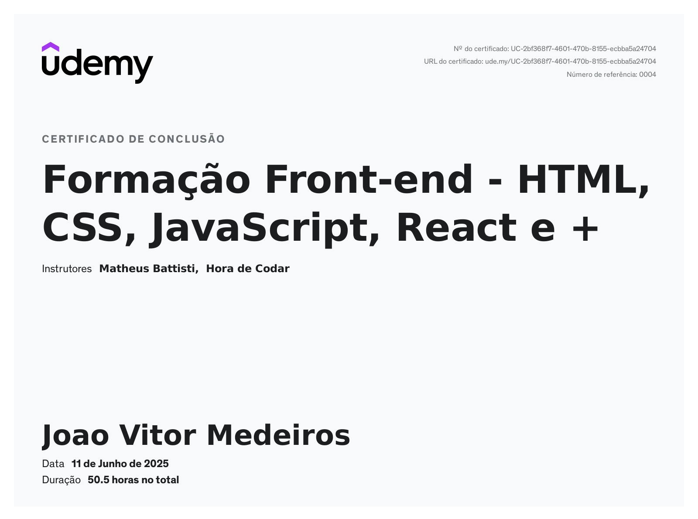
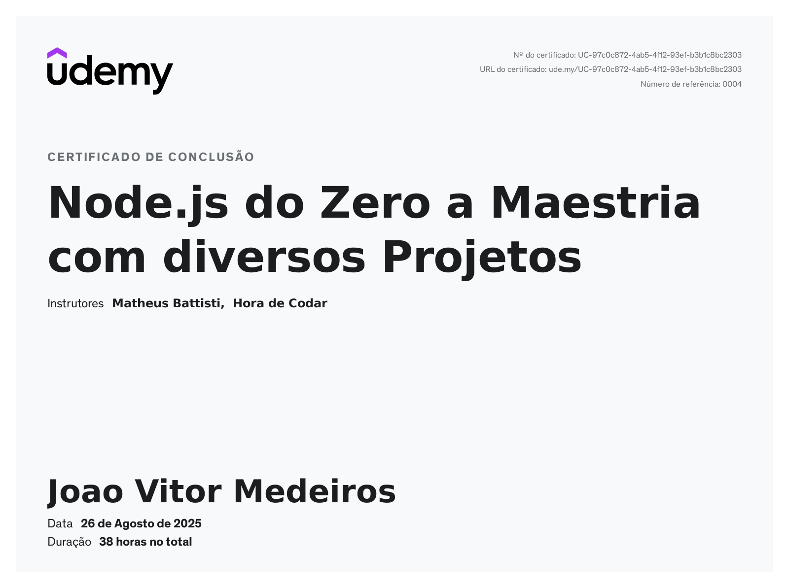
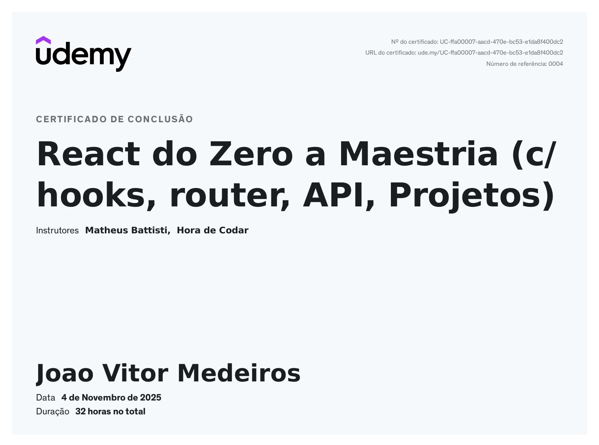

<h1 align="center">Olá! 👋 Eu sou João Vitor de Medeiros</h1>

<h3 align="center">
Desenvolvedor Full Stack | Node.js • Vue.js • JavaScript
</h3>

Apaixonado por desenvolvimento web, sempre buscando criar soluções simples, escaláveis e eficientes.

---

## 🚀 Sobre mim

Sou **Desenvolvedor Full Stack** com experiência no desenvolvimento de aplicações web utilizando **Node.js**, **Vue.js**, **JavaScript** e bancos de dados relacionais e não relacionais.

Atualmente atuo como **Desenvolvedor Full Stack na Vexur** e curso **Tecnologia em Sistemas para Internet** no **Instituto Federal do Paraná (IFPR)**.

Minha trajetória na tecnologia começou aos **17 anos**, atuando como **Técnico de Informática** durante quatro anos. Foi nesse período que despertei interesse pela programação e decidi direcionar minha carreira para o desenvolvimento de software onde atuo desde 2025.

Gosto de aprender novas tecnologias, enfrentar desafios e desenvolver soluções que realmente façam diferença.

---

## 💻 Tecnologias

### 🎨 Front-end

### ⚙️ Back-end

### 🗄️ Banco de Dados

### 🛠️ Ferramentas

---

## 🌱 Atualmente

- 💼 Desenvolvedor Full Stack na **Vexur**
- 📚 Graduando em **Tecnologia em Sistemas para Internet**
- 🚀 Estudando boas práticas, arquitetura de software e desenvolvimento de aplicações escaláveis.

---

## 📫 Contato

  

  

  

  

 

## 🎓 Certificações

<table>
  
<tr>
<td align="center"> Formação Front-end - HTML, CSS, JavaScript, React e +
</td>

<td align="center"> Node.js do Zero a Maestria com diversos Projetos
</td>

<td align="center"> React do Zero a Maestria (c/ hooks, router, API, Projetos)
</td>

</tr>
</table>

<table>
<tr>
<td align="center"> Git e GitHub do básico ao avançado (c/ gist e GitHub Pages)
</td>
  
<td align="center"> Neo4j Certified Professional
</td>

<td align="center"> Boas vindas ao Bootcamp Bradesco - GenAI, Dados & Cyber
</td>

</tr>
</table>
  

